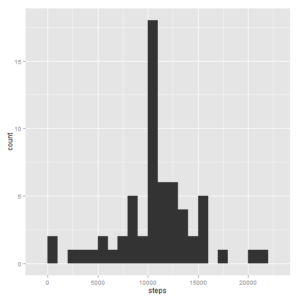

# Reproducible Research - Peer Assessment 1

## Load needed libraries

```r
library(ggplot2)
```


## Load and preprocess the data
0) The data file should be manually extracted from the zip file. 

1) Then, load / read the data.

```r
df <- read.csv("activity.csv", header = TRUE, colClasses = c("numeric", "Date", 
    "integer"), nrows = 17700)
```


2) Check that data is in useable format for analysis and tidy.

```r
str(df)
```

```
## 'data.frame':	17568 obs. of  3 variables:
##  $ steps   : num  NA NA NA NA NA NA NA NA NA NA ...
##  $ date    : Date, format: "2012-10-01" "2012-10-01" ...
##  $ interval: int  0 5 10 15 20 25 30 35 40 45 ...
```

```r
summary(df)
```

```
##      steps            date               interval   
##  Min.   :  0.0   Min.   :2012-10-01   Min.   :   0  
##  1st Qu.:  0.0   1st Qu.:2012-10-16   1st Qu.: 589  
##  Median :  0.0   Median :2012-10-31   Median :1178  
##  Mean   : 37.4   Mean   :2012-10-31   Mean   :1178  
##  3rd Qu.: 12.0   3rd Qu.:2012-11-15   3rd Qu.:1766  
##  Max.   :806.0   Max.   :2012-11-30   Max.   :2355  
##  NA's   :2304
```

```r
head(df)
```

```
##   steps       date interval
## 1    NA 2012-10-01        0
## 2    NA 2012-10-01        5
## 3    NA 2012-10-01       10
## 4    NA 2012-10-01       15
## 5    NA 2012-10-01       20
## 6    NA 2012-10-01       25
```

```r
tail(df)
```

```
##       steps       date interval
## 17563    NA 2012-11-30     2330
## 17564    NA 2012-11-30     2335
## 17565    NA 2012-11-30     2340
## 17566    NA 2012-11-30     2345
## 17567    NA 2012-11-30     2350
## 17568    NA 2012-11-30     2355
```


## What is mean total number of steps taken per day?
Sum steps by days. Ignore missing/NA values. This is assumed to be the mean of the total number of steps for each day.

```r
stepsbyDate <- aggregate(x = df$steps, by = list(date = df$date), na.rm = TRUE, 
    FUN = sum, simplify = TRUE)

names(stepsbyDate)[2] <- "steps"  #rename x from aggregate() to steps

head(stepsbyDate)
```

```
##         date steps
## 1 2012-10-01     0
## 2 2012-10-02   126
## 3 2012-10-03 11352
## 4 2012-10-04 12116
## 5 2012-10-05 13294
## 6 2012-10-06 15420
```


1) Create a histogram of total number of steps taken each day.  

```r
qplot(steps, data = stepsbyDate, binwidth = 1000)
```

 


2) Calculate the mean and median.

```r
meanSteps <- mean(na.omit(stepsbyDate$steps))
medSteps <- median(na.omit(stepsbyDate$steps))
```

Mean of steps taken per day:  9354.2  
Median of steps taken per day: 10395.0

## What is the average daily activity pattern?
Average the steps for all days in the original data set by the 5-minute intervals


```r
stepsbyInterval <- aggregate(x = df$steps, by = list(interval = df$interval), 
    na.rm = TRUE, FUN = mean, simplify = TRUE)

names(stepsbyInterval)[2] <- "steps"  #rename x from aggregate() to steps
str(stepsbyInterval)
```

```
## 'data.frame':	288 obs. of  2 variables:
##  $ interval: int  0 5 10 15 20 25 30 35 40 45 ...
##  $ steps   : num  1.717 0.3396 0.1321 0.1509 0.0755 ...
```

```r
head(stepsbyInterval)
```

```
##   interval   steps
## 1        0 1.71698
## 2        5 0.33962
## 3       10 0.13208
## 4       15 0.15094
## 5       20 0.07547
## 6       25 2.09434
```


1) Create a time series plot of average-number-of-steps-for-all-days per interval.  Because the x-asis is continous and the time interval data ranges from XX:00 to XX:55, there is a 45 minute gap in each hour from 00:00 to 23:55. This approach is consistent with the project example.

```r
qplot(interval, steps, data = stepsbyInterval, geom = "line")
```

 


2) Identify the 5-minute interval with the maximum average-number-of-steps-for-all-days

```r
maxInterval <- stepsbyInterval[which.max(stepsbyInterval[, 2]), ]
```


The interval with the maximum, on average, number of steps is 835.

## Imputing missing values
1) Identify the total number of missing values.

```r
nacount <- sum(is.na(df$steps))
```

The total number of rows with NAs is 2304

2) Create a method to fill in the missing values of steps. Will use the average-for-all-days of the 5-minute interval.

```r
# Use a logical vector to identify which rows in $steps contain NA
nasteps <- is.na(df$steps)
# create a vector of length(nasteps) that contains the interval average by
# repeating the interval average vector by the number of days in the dataset
intavgsteps <- rep(stepsbyInterval$steps, length(stepsbyDate$steps))
```


3) Create new dataset equal to original but with NAs replaced by average-for-all-days of the 5-minute interval.

```r
# replace NA's in df$steps with interval averages
newdf <- df
newdf$steps[nasteps] <- intavgsteps[nasteps]
head(newdf)
```

```
##     steps       date interval
## 1 1.71698 2012-10-01        0
## 2 0.33962 2012-10-01        5
## 3 0.13208 2012-10-01       10
## 4 0.15094 2012-10-01       15
## 5 0.07547 2012-10-01       20
## 6 2.09434 2012-10-01       25
```


4a) Create a histogram of the total steps taken each day using the new dataset (i.e., NAs replaced by averages). 

```r
newstepsbyDate <- aggregate(x = newdf$steps, by = list(date = newdf$date), na.rm = TRUE, 
    FUN = sum, simplify = TRUE)

names(newstepsbyDate)[2] <- "steps"  #rename x from aggregate() to steps
str(newstepsbyDate)
```

```
## 'data.frame':	61 obs. of  2 variables:
##  $ date : Date, format: "2012-10-01" "2012-10-02" ...
##  $ steps: num  10766 126 11352 12116 13294 ...
```


```r
qplot(steps, data = newstepsbyDate, binwidth = 1000)
```

 


4b) Report the mean and median of steps taken per day.

```r
newmeanSteps <- mean(na.omit(newstepsbyDate$steps))
newmedSteps <- median(na.omit(newstepsbyDate$steps))
```

Mean of steps taken per day (new):  10766.2  
Median of steps taken per day (new): 10766.2

4c) Do the mean and median of steps, with the NAs replaced, differ from the original data set?

Subtracting the new mean and median from the original calculations gives the following differences:  
Mean difference: 1412.0  
Median difference: 371.2

4d) The impact of replacing NAs with estimates is that the mean and median increase.


## Are there differences in activity patterns between weekdays and weekends?

1) Using the new data set (no NAs), create a factor variable with two values - a) weekday, b) weekend.


```r
newdf$weekday <- weekdays(newdf$date, abbreviate = TRUE)

newdf$dayend <- as.factor(ifelse(newdf$weekday %in% c("Sat", "Sun"), "weekend", 
    "weekday"))
head(newdf)
```

```
##     steps       date interval weekday  dayend
## 1 1.71698 2012-10-01        0     Mon weekday
## 2 0.33962 2012-10-01        5     Mon weekday
## 3 0.13208 2012-10-01       10     Mon weekday
## 4 0.15094 2012-10-01       15     Mon weekday
## 5 0.07547 2012-10-01       20     Mon weekday
## 6 2.09434 2012-10-01       25     Mon weekday
```

```r
tail(newdf)
```

```
##        steps       date interval weekday  dayend
## 17563 2.6038 2012-11-30     2330     Fri weekday
## 17564 4.6981 2012-11-30     2335     Fri weekday
## 17565 3.3019 2012-11-30     2340     Fri weekday
## 17566 0.6415 2012-11-30     2345     Fri weekday
## 17567 0.2264 2012-11-30     2350     Fri weekday
## 17568 1.0755 2012-11-30     2355     Fri weekday
```

```r
newdf[2000:2005, ]
```

```
##      steps       date interval weekday  dayend
## 2000     0 2012-10-07     2235     Sun weekend
## 2001     0 2012-10-07     2240     Sun weekend
## 2002     0 2012-10-07     2245     Sun weekend
## 2003     0 2012-10-07     2250     Sun weekend
## 2004     0 2012-10-07     2255     Sun weekend
## 2005     0 2012-10-07     2300     Sun weekend
```


2) Make a panel time-series plot averaged across all weekday and weekend days. 

Aggregate the new data-set by interval and dayend.

```r
newstepsbyInterval <- aggregate(x = newdf$steps, by = list(dayend = newdf$dayend, 
    interval = newdf$interval), na.rm = TRUE, FUN = mean, simplify = TRUE)

names(newstepsbyInterval)[3] <- "steps"  #rename x from aggregate() to steps
```


Create a time series plot of average-number-of-steps-for-all-days per interval. Use ggplot2/ggplot.


```r
g <- ggplot(newstepsbyInterval, aes(interval, steps))
# ggplot2 facet strip on right
g + geom_line(color = "blue") + facet_grid(dayend ~ .) + xlab("Interval") + 
    ylab("Number of Steps") + theme_bw() + theme(strip.background = element_rect(fill = "beige"), 
    panel.grid.major = element_blank(), panel.grid.minor = element_blank())
```

 


